# Saola 🇻🇳

> Point the camera at a temple roof, a bowl of noodles or a street sign — the app recognises
> it, tells the story behind it, and keeps it in your journey.

🇻🇳 [Bản tiếng Việt](README.md) · 🛠 [Technical detail](TechStack-temp.md)

---

## 1. What this app is

Saola is a travel app that uses **Google Gemini** to turn the phone camera into a local
guide.

Instead of searching Google, reading Wikipedia and opening a separate translation app, the
traveller just holds the phone up. The AI recognises the landmark, dish or artefact in frame,
explains its history and cultural meaning, translates menus and signs, and answers follow-up
questions — all on one screen.

What sets it apart from an ordinary travel app: **everything you photograph is kept**. Your
own pictures fill in a map of Vietnam's 34 provinces, unlock a board of 61 things worth
finding, and each day is written up by the AI as a page of a journal.

The app runs on **Android and iOS** from one shared codebase, speaks **eight languages**, and
keeps all of the traveller's data on their own device — no account, no server.

---

## 2. Features

### Core — recognise and converse

| Feature | What it does |
|---|---|
| **Five lens modes** | Auto · Heritage · Food · Museum · Translate |
| **Structured recognition** | Returns a name, local name, summary, sections, tags and a confidence — not a wall of prose |
| **Contextual chat** | Ask follow-up questions grounded on the place you just photographed; history is kept |
| **Narration** | Reads answers and translations aloud in the device's language |
| **Menu & sign translation** | On-device OCR plus translation, overlaid in place over each line of text |

### The distinctive part — what brings people back

**🗺 Travel passport.** Vietnam drawn as its **34 post-2025 provinces**, each one filling in
with the photograph you took there, clipped to that province's real outline. **There is no
check-in button** — a photo already carries its coordinates, so photographing a pagoda *is*
the check-in. **Hoàng Sa and Trường Sa** are included in inset boxes, the way every Vietnamese
map draws them.

**🎴 Culture collection.** 61 things worth finding in Vietnam — phở, bánh chưng, the upturned
eaves of a communal house, a basket boat, a stele on a stone tortoise, a gong. Each tile is a
hatched square until you photograph the thing, and then it fills with **your own picture**. The
board is full from the first launch, and it counts photographs you took weeks ago. A switch in
the page header turns it between **Board** — the record of what you have photographed — and
**Guide**: the same 61 entries with their recognition hints spelled out, *"a thin turmeric-yellow
crêpe folded into a half-moon"* rather than only a name you already knew.

**🧭 Explore.** A live map of what is worth walking to within **5 km**. The data comes from
**OpenStreetMap + Wikipedia + Wikimedia Commons** — no API key, no billing. Ranked by
Wikipedia readership over the last 60 days and by how carefully somebody mapped the place.
**There are no star ratings**, because no open source carries them — better to be missing a
number than to invent one. Place names follow the device's language wherever OSM holds a
translation, with the Vietnamese name under the title on the detail sheet — because the sign
on the street still says the Vietnamese one.

**📖 Travel journal.** Grouped by day, with an AI-written summary of each day and ideas for
tomorrow.

**🌏 Eight languages.** Vietnamese · English · Japanese · Korean · Chinese · French · Spanish ·
Thai. The interface, the AI's answers and the narration voice all **follow the device
language** — a Japanese phone gets Japanese screens, Japanese answers and a Japanese voice.

**📱 Two layouts.** Phones use a bottom tab bar; tablets and wide windows use a vertical
navigation rail and a two-pane layout — read the article on the left, ask the guide on the
right.

---

## 3. Screenshots

Retaken on 07.08.2026 on Pixel 7 Pro, Pixel Tablet, iPhone 17 and iPad Pro 11" simulators, with
the 24-place demo dataset from Sa Pa to Cần Thơ (see
[TechStack §10](TechStack-temp.md#10-demoing-it-and-the-seeded-data)); the pictures inside the
app are real photographs from Wikimedia Commons. The one exception is the tablet Explore shot,
taken on a **Pixel 7 Pro forced to the Pixel Tablet's own metrics** (`wm size 2560x1600`,
`wm density 320`) because the tablet AVD would not accept a mock location during the session —
same window measurements, so the arrangement is the real one.

### Android — phone

| Lens | Journal | Travel passport | Culture collection |
|---|---|---|---|
|  |  |  |  |

| Discovery detail | Chat | Explore nearby |
|---|---|---|
|  |  |  |

| Place detail | Menu translation | Settings |
|---|---|---|
|  |  |  |

### Android — tablet

The wide layout: a vertical navigation rail on the left and two content panes side by side.

| Lens | Journal + passport | Collection |
|---|---|---|
|  |  |  |

| Article + ask the guide | Explore | Settings |
|---|---|---|
|  |  |  |

### iOS — iPhone

| Lens | Journal | Passport | Collection |
|---|---|---|---|
| 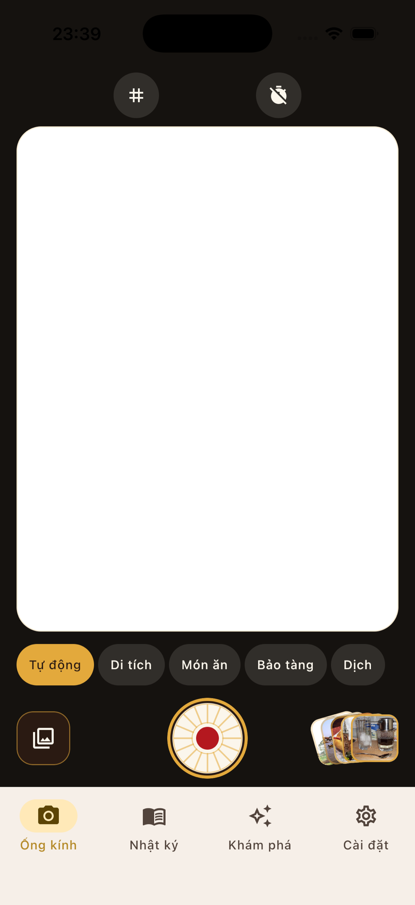 | 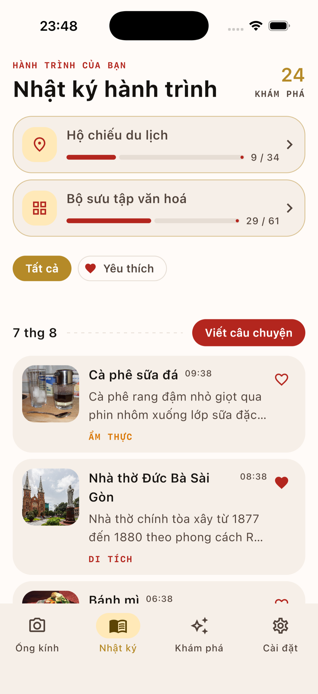 | 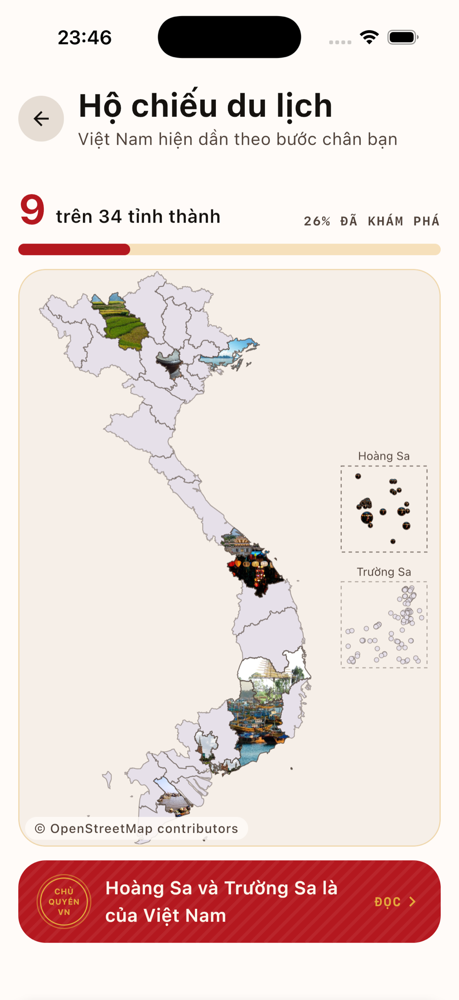 | 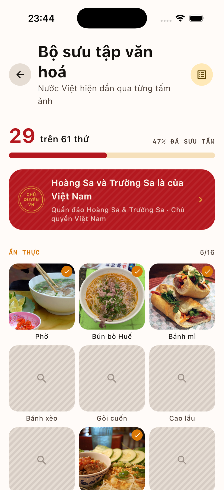 |

| Discovery detail | Chat | Explore (MapKit) | Settings |
|---|---|---|---|
| 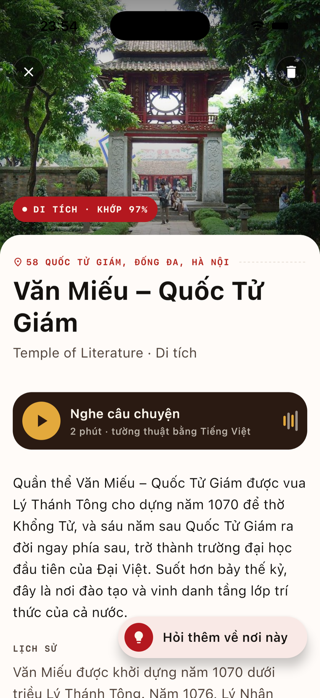 |  | 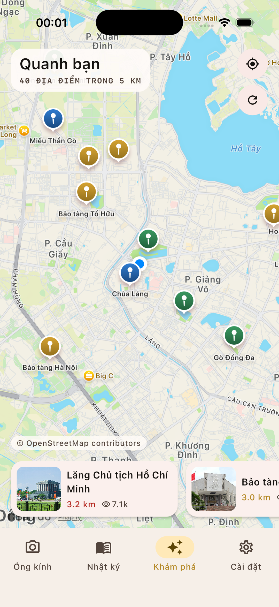 | 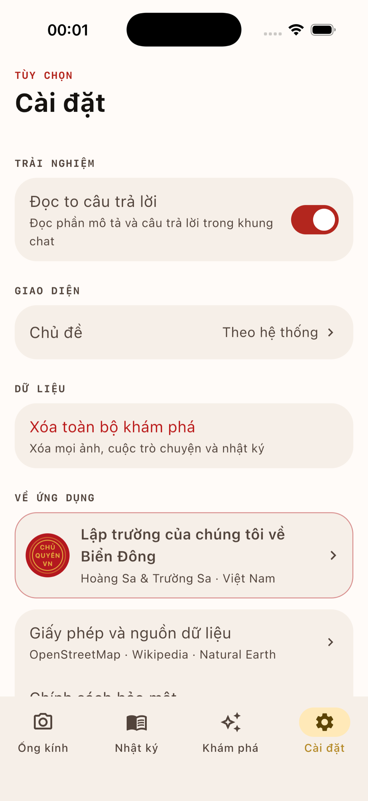 |

> The viewfinder is blank in the Lens shots because the iOS Simulator has no camera. Everything
> else on the screen — the modes, the shutter, the recent-capture pile — is real.

### iOS — iPad

| Lens | Journal + passport | Collection |
|---|---|---|
| 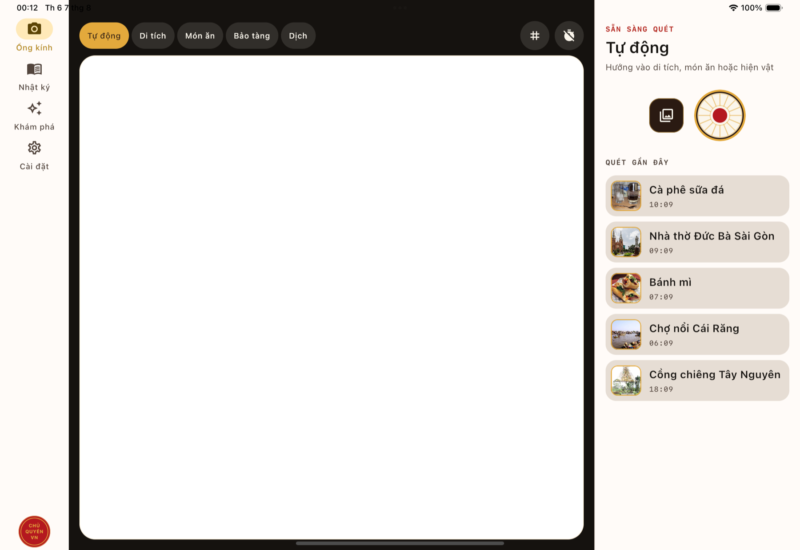 | 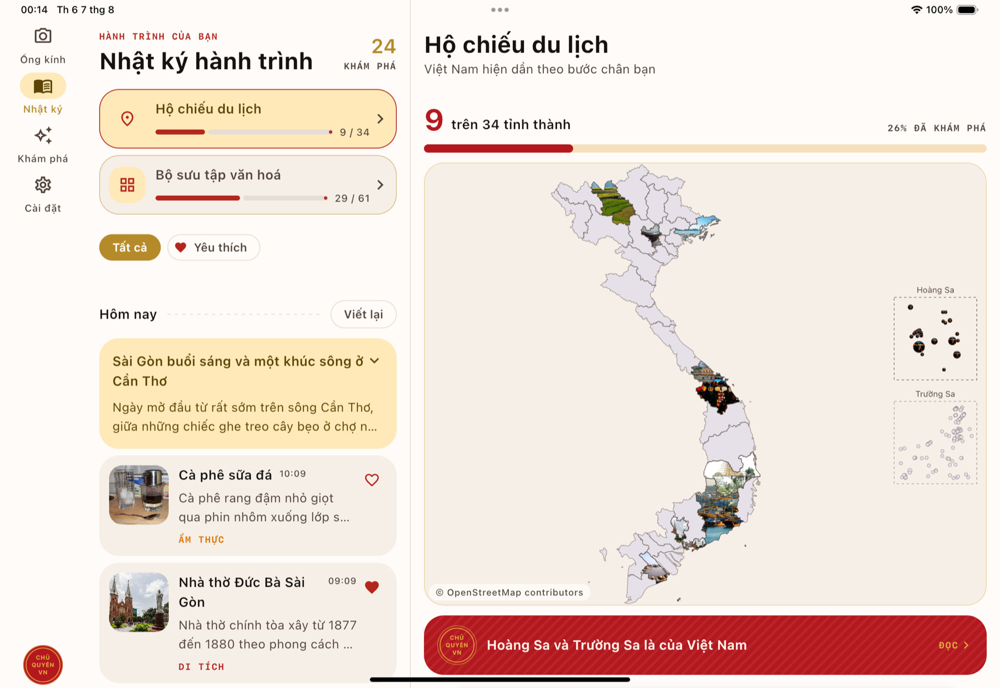 | 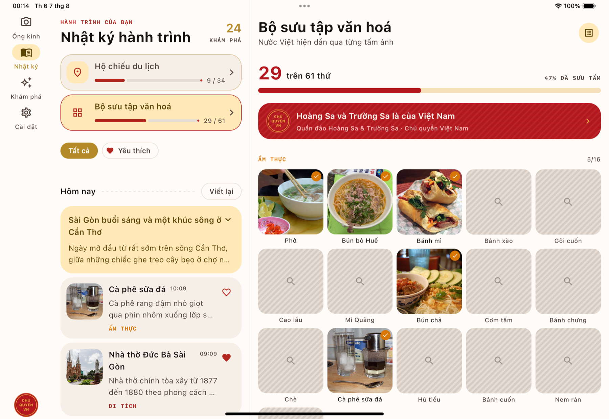 |

| Article + ask the guide | Explore | Settings |
|---|---|---|
|  | 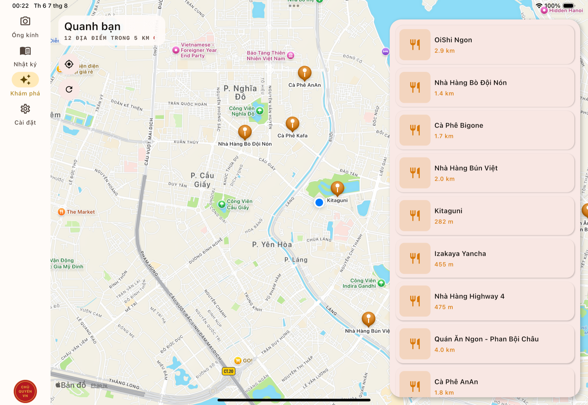 | 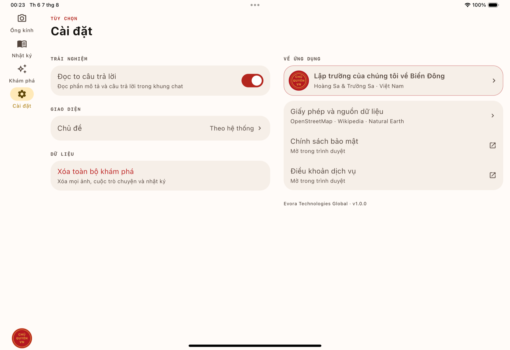 |

> **Three of the four Explore shots show restaurants and no landmarks.** Overpass (the
> OpenStreetMap query server) rate-limits per IP, and the sights half of the query is the
> heavier one, so it is refused first. That is the app's real behaviour under throttling, not a
> layout fault — the iPhone shot was taken in a window where the limit had recovered and carries
> the full **40 places** with landmarks, for comparison.

---

## 4. Technology

One Kotlin Multiplatform codebase runs on both platforms; **every screen, every ViewModel and
the whole design system is written once** in Compose Multiplatform. Only the camera, OCR, maps,
location and narration are written per platform.

| Area | Technology | Version |
|---|---|---|
| Language | Kotlin Multiplatform | 2.3.21 |
| Build | AGP · KSP · JDK | 9.2.1 · 2.3.10 · 17+ |
| UI | Compose Multiplatform | 1.12.0-beta03 |
| Navigation | Navigation Compose (JetBrains) | 2.9.2 |
| Lifecycle / ViewModel | Lifecycle (JetBrains) | 2.11.0 |
| Architecture | Clean Architecture + MVI (`MviViewModel<S, I, E>`) | — |
| Dependency injection | Koin | 4.2.2 |
| Database | Room (multiplatform) + bundled SQLite | 2.8.4 · 2.7.0 |
| Preferences | DataStore Preferences | 1.2.1 |
| Networking | Ktor Client (OkHttp on Android, Darwin on iOS) | 3.5.1 |
| JSON | kotlinx.serialization | 1.11.0 |
| Concurrency | kotlinx.coroutines | 1.11.0 |
| Date / time | kotlinx-datetime | 0.8.0 |
| Images | Coil 3 | 3.4.0 |
| Camera | CameraX (Android) · AVFoundation (iOS) | 1.6.1 · platform |
| OCR | ML Kit — Latin, Chinese, Japanese, Korean (Android) · Vision (iOS) | 16.0.1 · platform |
| Maps | Maps Compose (Android) · MapKit (iOS) | 8.3.1 · platform |
| Location | Play Services Location · CoreLocation | 21.4.0 · platform |
| Narration | TextToSpeech · AVSpeechSynthesizer | platform |
| Logging | Kermit (logcat / os_log) | 2.1.0 |
| **AI** | **Google Gemini 3** via the Google AI Studio REST API | 3.5-flash → 3.1-flash-lite → 3-pro-preview |
| Testing | JUnit4 · MockK · Turbine · Ktor MockEngine · Koin test | 4.13.2 · 1.14.11 · 1.2.1 |

**Platform floor:** Android 8.0 (API 26) and above · iOS 16.0 and above.

**Four modules**, dependencies pointing one way, inwards:

```
:app  →  :shared  →  :domain  ←  :data
Android   the whole   pure       Room, Ktor,
 host    presentation Kotlin     DataStore
```

**Two technical decisions worth explaining to a non-engineer:**

- **Gemini returns JSON bound to a schema**, not prose. That is why the result screen always
  has every field it needs and never has to guess at what the AI wrote.
- **A model fallback chain.** Gemini Flash routinely returns `503` at peak times. Failing there
  would show an error to someone standing in front of a temple, so a request walks down to the
  next model and only gives up when the whole chain is busy.

The full detail — 34-province map geometry, the Overpass query, R8/AGP, APK signing — is in
[TechStack-temp.md](TechStack-temp.md).

---

## 5. Where the data lives

**Everything stays on the traveller's device. No account, no server, no analytics.**

| Data | Stored in | Notes |
|---|---|---|
| Discoveries, conversations, notes, translations, day summaries | **Room (SQLite)** — five tables | The single source of truth; screens read it through `Flow`, so it works offline |
| Photographs | **JPEG files** in the app's own directory | EXIF-corrected upright, downscaled to a 1024 px long edge |
| Preferences (theme, narration, location) | **DataStore Preferences** | The API key and the model are **no longer here** as of 06.08.2026 — both are build decisions |
| The 34 provinces and 61 catalogue entries | **Assets bundled in the app** | Read-only, no network needed |
| Nearby-place data | **In memory** — 15 minutes / 300 m | Deliberately not on disk: this is data about where you *are*, and reopening the app onto last week's city would be wrong |

**The database stores a photo's *file name*, never a path.** On iOS the app's data directory is
renamed on every reinstall, update or restore, so a path stored yesterday points at a directory
that no longer exists. That bug once deleted **every photograph** a user had.

**What leaves the device:** the photo being recognised (to Gemini), the current coordinates (to
OpenStreetMap / Wikipedia), and map tiles. Nothing else.

**The Gemini API key** is read from `local.properties` at build time (never committed), and from
nowhere else. The paste-your-own field went with the whole *Intelligence* section on 06.08.2026:
asking a traveller for an API key is asking them to hold a developer's credential, and two key
sources mean the app's behaviour depends on which one happens to be in play. **The model** took
the same route — `GeminiModel.CONFIGURED` in `domain/model/AppSettings.kt` is one line, edited
and rebuilt.

---

## 6. Who it is for

| Audience | Why it fits |
|---|---|
| **International visitors to Vietnam** | The two hardest barriers are the script and the cultural context — the app handles both in their own language |
| **Vietnamese travelling domestically** | The 34-province passport and the culture board turn a trip into something collectable |
| **Students** | On-the-spot lookup in museums and heritage sites, with content broken into sections rather than one block of text |
| **Museums and heritage sites** | Works as an intelligent audio guide with no hardware to buy |
| **Tour operators** | Supports the guide during the parts of a tour where guests explore on their own |

**Primary focus for the first phase:** international visitors and independent Vietnamese
travellers — the two groups whose main tool is a phone and who have no guide beside them.

---

## 7. Current status

| Item | Status |
|---|---|
| Camera capture / gallery import, five lens modes | ✅ |
| Landmark / food / artefact recognition with structured output | ✅ |
| Contextual chat, history persisted | ✅ |
| Narration of answers and translations | ✅ |
| OCR + translation of menus and signs, overlaid in place | ✅ |
| Journal grouped by day + AI day summary | ✅ |
| Travel passport across 34 provinces | ✅ |
| Culture collection of 61 entries | ✅ |
| Explore what is worth walking to within 5 km | ✅ |
| Eight-language UI and narration, following the device | ✅ |
| Offline-first reads (Room as the single source of truth) | ✅ |
| Tablet / wide-window layout | ✅ |
| iOS (Compose Multiplatform + MapKit) | ✅ |
| Guide mode — all 61 recognition hints on the board | ✅ |
| "In your collection" card on the recognition result | ✅ |
| Both maps usable with a screen reader | ✅ |
| Licences screen + ODbL credit on the maps | ✅ |
| Explore place names in the device's language (`name:en` from OSM) | ✅ |
| Voice dictation | ❌ removed — the code was finished but no button ever reached it |
| AI-generated destination suggestions | ❌ removed — addresses and prices were invented; replaced by **Explore** |

**Two limitations to know before a demo:**

1. **Overpass is donated infrastructure with per-IP limits.** A burst of traffic gets refused
   until it recovers.
2. **Most places have no photograph.** OSM holds no images; only well-known places carry a
   Wikipedia article or a Commons photo.

The third — *"accessibility is not done"* — was closed on 06.08.2026. The passport map now
carries a hidden node over each province, so a screen reader reads the name and the state of
all 34 plus both archipelagos, and a double-tap opens the province panel. Verified with
`uiautomator dump` on a Galaxy A16: 36 nodes, where there had been none.

---

## 8. Roadmap

**Near term — done on 06.08.2026**

Every one of the seven was "bring out what is already there"; none needed new data:

- ✅ **The unlock moment is no longer silent.** The recognition result carries a card — *In your
  collection · Phở · 29/61* — that opens the board. State rather than a snackbar, so it survives
  a rotation and is still there on a later visit, and it doubles as the link between a
  photograph and its tile.
- ✅ **The collection is a guide.** A switch in the header turns the board into rows with all 61
  recognition hints beside the names. The Vietnamese hints run 63–103 characters, which is why
  they cannot simply be printed under a tile three across.
- ✅ **Accessibility for both maps.** Passport: 34 province nodes plus 2 archipelagos, each named
  with its state and openable. Explore: the map carries a description on Android and iOS, every
  marker its place's name, and the ranked list beside it is the path that needs no map at all.
- ✅ **A licences screen.** Settings → About → *Licences and data sources*: OpenStreetMap (ODbL
  1.0), Natural Earth, Wikipedia (CC BY-SA 4.0), Wikimedia Commons, each with a way through to
  the licence itself — plus the credit **on** both maps, which is what ODbL §4.3 asks for.
- ✅ **Tests for the UI layer.** Six of them, on a real device: the passport map's projection and
  hit test, its semantics tree, and the board/guide switch. `:shared` went from 118/107 to
  **123/112**, the project total from 455 to **465**, and the device suite from 12 to **18**.
- ✅ **Place names in the device's language.** Explore reads `name:<language>` and then `name:en`
  from OSM, so an English phone opens on *Vietnam Military History Museum* rather than *Bảo tàng
  Lịch sử Quân sự Việt Nam*. That data was **already in the Overpass response** and was being
  discarded, so it costs no extra request. The Vietnamese name is not lost — it sits under the
  title on the detail sheet, because the sign in front of the traveller still carries it. A
  Vietnamese phone deliberately does **not** take the English fallback: for exactly one language
  it is a downgrade. Measured on a Galaxy A16 by pinning the app to `en-US` and back to `vi-VN`
  against the same 40 results. `:data` went from 120/86 to **126/92**, the project total to
  **477**.
- ✅ **Settings pared back to what a traveller actually chooses.** The *Intelligence* section —
  the API-key field and the three model cards — is gone: both are build decisions
  (`local.properties` and `GeminiModel.CONFIGURED`) rather than questions to put to a traveller,
  and "Gemini 3.5 Flash or 3 Pro" is answerable only by somebody who already knows Google's
  catalogue. In its place, *About* gained **Privacy policy** and **Terms of service**, opening in
  the browser and sharing a card with *Licences*; the two cards in that section now have real
  space between them instead of meeting edge to edge. The footer reads *Evora Technologies
  Global · v1.0.0*. A defect of the same family was fixed along the way: clearing all discoveries
  announced "cleared" whether or not the delete **worked** — the confirmation now waits on the
  delete actually landing. Project total 477 → **475** (two `GeminiModel.fromId` cases lost, one
  gained for `CONFIGURED`).

**Near term — what is left**

- Marker clustering on the explore map, where 40 places overlap. Android stacks the pins, so the
  covered one cannot be tapped; iOS **hides** the loser by `displayPriority`, so the place leaves
  the map entirely. The ranked list beside it still carries all 40, which makes this a loss at
  the drawing layer rather than a loss of data.

**Medium term — extend the capability**

- **Gemini Live API** — real-time voice conversation
- **Offline mode** — download one province's data and work without a network
- **Voice dictation** (restore what was removed, this time with a button)

**Long term — product**

- **AR navigation** — directions and labels drawn over the live camera
- **Family / kids mode** — shorter content, a different narrative voice
- **Community contributions** — travellers propose entries for the culture collection
- Broaden the collection for highland, Cham and Mekong-delta material (currently Kinh-majority)
- Partner with museums and heritage sites for verified content

---

## 9. Getting started

```bash
# Android
./gradlew :app:installDebug

# iOS
open iosApp/iosApp.xcodeproj     # run the iosApp scheme

# Tests (no network, no API key needed)
./gradlew test
```

**The debug build seeds itself.** Open it once and it already holds 24 discoveries from Sa Pa
to Cần Thơ, a conversation and three journal write-ups — enough to look at the passport, the
collection and the journal without going out to photograph anything. The only condition is an
empty journal, so **Settings → clear everything** is the button that puts a demo build back
into a good state.

**`release` and `fastRelease` never seed, and cannot**: the 3.5 MB of demo photographs is
packaged into the `debug` variant only, so a shipping APK has nothing to seed from. Run a
release build to see the real empty state.

You need a Gemini key from [Google AI Studio](https://aistudio.google.com/apikey) in
`local.properties` — there is no in-app way to supply one, so a build without it says so on the
lens screen and recognises nothing. Full instructions, including the Android Maps SDK key and
how to produce a release build, are in
[TechStack-temp.md §9–§11](TechStack-temp.md#9-getting-started).

---

## 10. AI Riser Vietnam 2026

**Category:** Cultural Tourism & Sports · **AI platform:** Google Gemini, Google AI Studio

> Making every traveller in Vietnam feel like they are exploring with a knowledgeable local
> beside them.

**Data attribution:** province boundaries and place data © OpenStreetMap contributors (ODbL) ·
coastline from Natural Earth (public domain) · article text and readership from Wikipedia
(CC BY-SA) · photographs from Wikimedia Commons under their individual licences.
